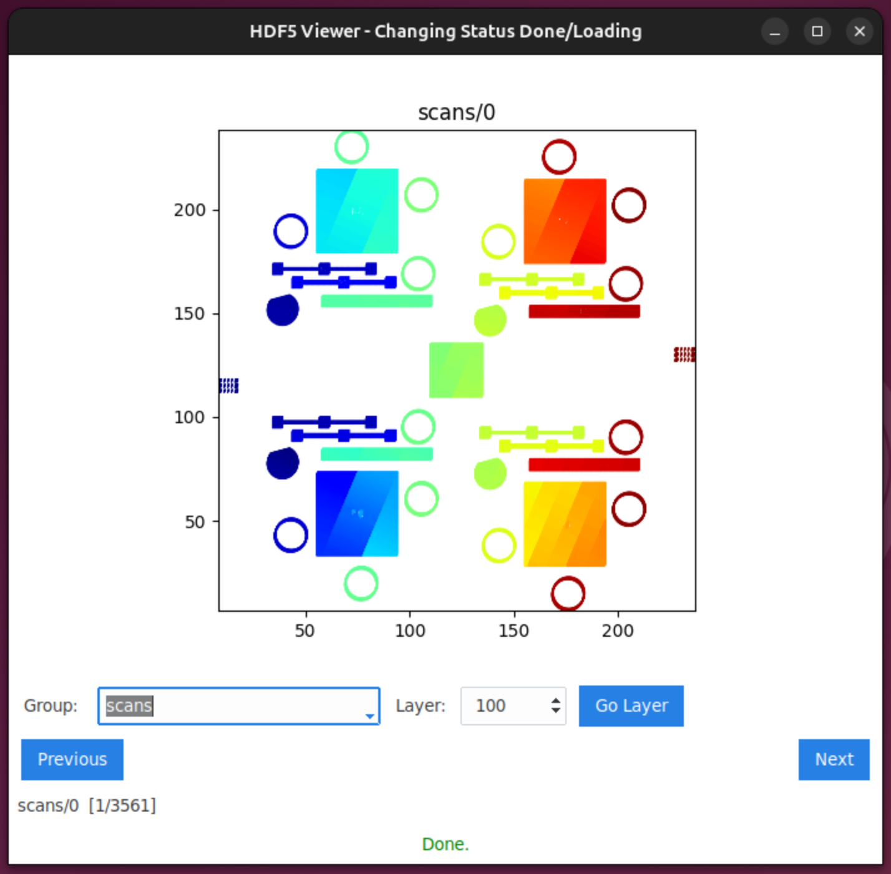
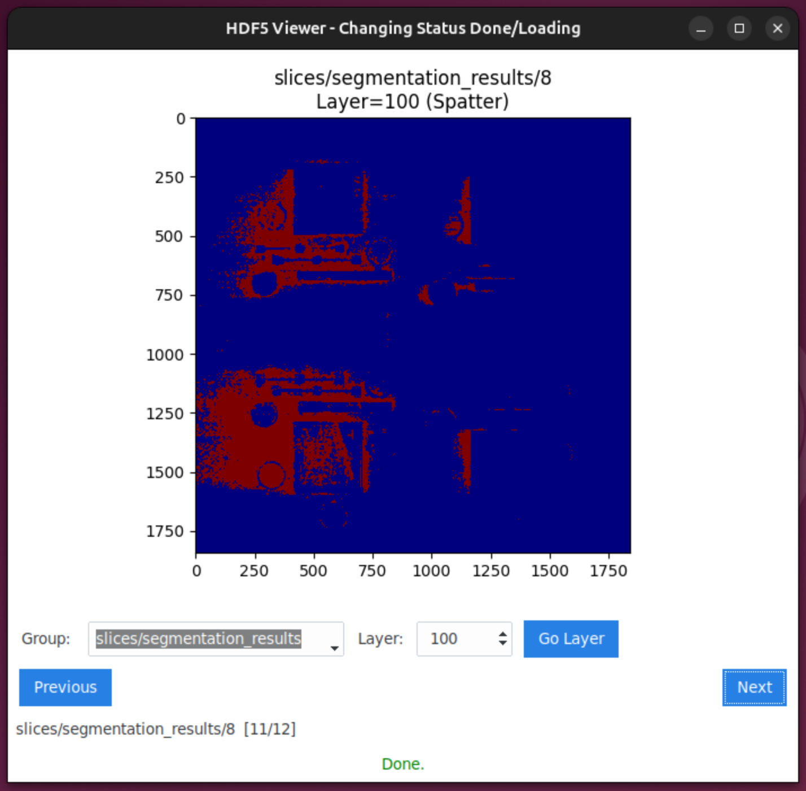

# LPBF Spatter Analysis with Physics-Guided Machine Learning

This repository contains code and experiments for the project behind the paper
**"Investigating how spatter evolves in metal additive manufacturing processes with machine learning"** (presented at RAPDASA 2025). The goal is to analyze how spatter and instabilities develop during Laser Powder Bed Fusion (LPBF), using physics-informed features and machine-learning methods - and to demonstrate that minimal physics guidance can significantly improve data efficiency and predictive robustness.

📄 **[Read the full paper](https://www.matec-conferences.org/articles/matecconf/pdf/2025/11/matecconf_rapdasa2025_05001.pdf)**

## Project Overview

-   LPBF is widely used for metal additive manufacturing, but defects such as spatter and melt-pool instabilities remain a challenge for reliability and quality control.
-   This work leverages in-situ data from Oak Ridge National Laboratory (ORNL), combining sensor logs, scan paths, and image data.
-   Instead of using large deep-vision models (e.g., Transformers), we engineer physics-based features derived from domain knowledge (e.g., thermal, fluid, melt-pool dynamics). On top of that, we impose light physics constraints to guide a machine-learning model.
-   The resulting physics-guided ML model achieves strong predictive performance using approximately 40% less training data compared to a standard multilayer-perceptron baseline.
-   The findings demonstrate that minimal physics knowledge - when properly encoded - can improve data efficiency and reliability, making real-time LPBF defect monitoring more feasible.
-   **This repository was built with MLOps best practices in mind**, providing a clear path from research notebooks to production-ready deployments on real-time manufacturing systems.

## Repository Structure

```
/data/                  # Dataset storage and preprocessing scripts
/src/                   # Core code: feature engineering, model definitions, training & evaluation pipelines
/notebooks/             # Jupyter notebooks for analysis and experimentation
  ├── 01_eda_and_data_preparation.ipynb              # Data loading, exploration, and YOLO export
  ├── 02_data_analysis_and_feature_engineering.ipynb # Physics-based feature engineering
  ├── 03_physics_vs_data_driven_comparison.ipynb     # Model comparison and results
  └── experiments/                                    # Deep learning model experiments
      ├── exp_01_yolo_v11.ipynb                       # YOLO v11 segmentation
      ├── exp_02_vit_segmentation_quick.ipynb         # Vision Transformer (quick test)
      ├── exp_03_vit_segmentation_full.ipynb          # Vision Transformer (full training)
      ├── exp_04_segformer.ipynb                      # Segformer baseline
      ├── exp_05_benchmark_etl.ipynb                  # ETL pipeline benchmarking
      └── exp_06_benchmark_vectorization.ipynb        # Vectorization optimization tests
/experiments/           # Training logs, saved models, evaluation scripts
/tests/                 # Unit tests for reproducibility
README.md               # This file
```

### Key Notebooks

The main analysis workflow follows a sequential pipeline documented in three primary notebooks:

1. **`01_eda_and_data_preparation.ipynb`** - Exploratory data analysis of HDF5-based LPBF datasets, data inspection, visualization of anomaly classes, and export to YOLO format for computer vision tasks.

2. **`02_data_analysis_and_feature_engineering.ipynb`** - Physics-informed feature engineering including melt-pool dynamics (Rosenthal model), recoil pressure calculations, gas flow modeling, and correlation analysis with spatter/streak anomalies. Exports engineered features for modeling.

3. **`03_physics_vs_data_driven_comparison.ipynb`** - Comparison of physics-guided ML models versus pure data-driven approaches, demonstrating ~40% data efficiency gains through minimal physics constraints. Contains final results and visualizations.

### Experimental Notebooks

The `notebooks/experiments/` folder contains exploratory work on deep learning approaches for segmentation and benchmarking studies:

-   **YOLO & Vision Transformers** - Alternative vision-based models for spatter/streak detection
-   **Benchmarking** - Performance optimization studies for data loading and preprocessing pipelines

## Quick Start / Usage

```bash
# Clone repository
git clone https://github.com/Brighton94/spatter-analysis-ml.git
cd spatter-analysis-ml

# Create data directories (if not using devcontainer)
mkdir -p data/precomputed data/tcr_phase1_build2 data/legacy

# (Optional) create virtual environment
python -m venv venv
source venv/bin/activate   # Linux / macOS
# or `venv\Scripts\activate` on Windows

# Install dependencies
pip install -e ".[dev]"

# Run feature engineering + model training pipeline
python src/train.py --config configs/your_config.yaml

# Evaluate model
python src/evaluate.py --model_path path/to/model
```

**Note:** If using the devcontainer, the data directories will be created automatically on container startup.

## HDF5 Viewer Application

A custom GUI application (`src/hdf5_viewer.py`) was created to efficiently explore and analyze the large HDF5 datasets from ORNL. Standard HDF5 tools lack specialized features for visualizing LPBF-specific data like layer-by-layer images, scan paths, and anomaly distributions. This viewer provides an interactive interface to navigate through builds, inspect camera feeds, overlay segmentation masks, and correlate process parameters with observed defects; streamlining the exploratory data analysis workflow.

<p align="center">
  <picture>
    <source media="(max-width: 768px)" srcset="docs/images/hdf5_viewer_scans.png" />
    
  </picture>
  <picture>
    <source media="(max-width: 768px)" srcset="docs/images/hdf5_viewer_spatter.png" />
    
  </picture>
</p>

## Running the GUI viewer (hdf5_viewer) on Linux

The `src/hdf5_viewer.py` script requires an X11 display. If you see `_tkinter.TclError: couldn't connect to display` errors in a container or headless environment, use one of these fixes:

**Option 1: X11 forwarding (to see the GUI)**

```bash
# On host
xhost +local:root

# In container
export DISPLAY=$DISPLAY
python ./src/hdf5_viewer.py
```

**Option 2: Headless mode (Xvfb)**

```bash
# Install dependencies
sudo apt-get update && sudo apt-get install -y python3-tk xvfb

# Run headless
xvfb-run python ./src/hdf5_viewer.py
```

For SSH sessions, use `ssh -X` or `ssh -Y` to enable X11 forwarding automatically.

**macOS:** Install [XQuartz](https://www.xquartz.org/), then use `xhost +localhost` and set `DISPLAY=host.docker.internal:0` in the container.

If you use custom dataset paths / external data storage (e.g. ORNL data), make sure to update the paths in configuration files before running.

## Results and Findings

-   Physics-guided ML reaches comparable (or better) predictive performance compared to standard ML models, while using about 40% fewer training samples.
-   This demonstrates significant gains in data efficiency and robustness.
-   It shows that physics-informed features plus light constraints are viable for real-time LPBF defect monitoring (spatter and melt-pool instabilities), potentially enabling better quality control in metal 3D printing.

For detailed results - tables, plots, performance metrics - see the /experiments folder or relevant notebooks / result files.

## Motivation and Impact

-   Metal additive manufacturing (especially LPBF) is sensitive to defects like spatter and melt-pool instability, which affect part quality and reproducibility.
-   Fully data-driven deep-learning approaches (e.g. vision-transformers) often require very large datasets - not always available in research or industrial settings.
-   By introducing physics-guided ML, this project demonstrates a middle ground: combining domain knowledge with ML to reduce data requirement while maintaining - or improving - predictive power.
-   This approach may be more accessible for researchers and practitioners working with limited data, and can facilitate real-time defect monitoring in actual manufacturing environments.

## Contributors and Future Extensions

Possible directions / suggestions:

-   Extend feature engineering to include additional physics-derived features (e.g. melt-pool geometry, thermal gradients, scan strategy parameters).
-   Incorporate segmentation / computer-vision-based defect detection (e.g. for spatter visible in images / video frames).
-   Integrate alternative ML models (CNNs, hybrid physics + vision networks) for comparison.
-   Add a real-time data ingestion & inference pipeline (for industrial LPBF machines).
-   Integrate evaluation metrics relevant to manufacturing - e.g. defect rate, quality thresholds, alerting mechanisms.

If you fork or modify, consider opening a pull request or issue describing your changes/ideas.

## Citation

If you use or build upon this project - please cite the associated paper:

> “Investigating how spatter evolves in metal additive manufacturing processes with machine learning” (RAPDASA 2025)

Also include reference to ORNL’s in-situ LPBF dataset (when permitted) and comply with any licensing or data-use agreements.

## License & Data Disclaimer

### License

This project is released under the **MIT License**. You are free to use, modify, and distribute this code for academic, research, or commercial purposes, provided that proper attribution is given.

See the [LICENSE](LICENSE) file for full details.

### Data Sources and Usage

This research utilizes in-situ monitoring data from **Oak Ridge National Laboratory (ORNL)** collected during Laser Powder Bed Fusion (LPBF) additive manufacturing processes. The dataset includes:

-   High-resolution layer-by-layer images from multiple cameras
-   Process parameters (laser power, scan speed, hatch spacing)
-   Environmental sensor data (oxygen levels, gas flow rates)
-   Segmentation masks for various anomaly classes (spatter, streaking, etc.)

**Important:** The ORNL dataset used in this work may be subject to access restrictions and data-use agreements. If you wish to reproduce this work:

1. **Request access** to the ORNL LPBF dataset through appropriate channels
2. **Comply with all licensing terms** and data-use agreements stipulated by ORNL
3. **Do not redistribute** the raw dataset without proper authorization
4. **Cite appropriately** both this work and the original ORNL data source

The code and methodologies in this repository are provided to enable reproducibility and extension of the research, but users must obtain their own authorized access to the underlying datasets.

### Reproducibility Without Proprietary Data

While the primary experiments use ORNL data, the physics-guided ML framework and feature engineering pipelines (`src/utils/feature_engineering.py`, `src/utils/build_features.py`) are generalizable to other LPBF datasets. Users with access to alternative in-situ monitoring data can adapt the preprocessing and model training scripts accordingly.
